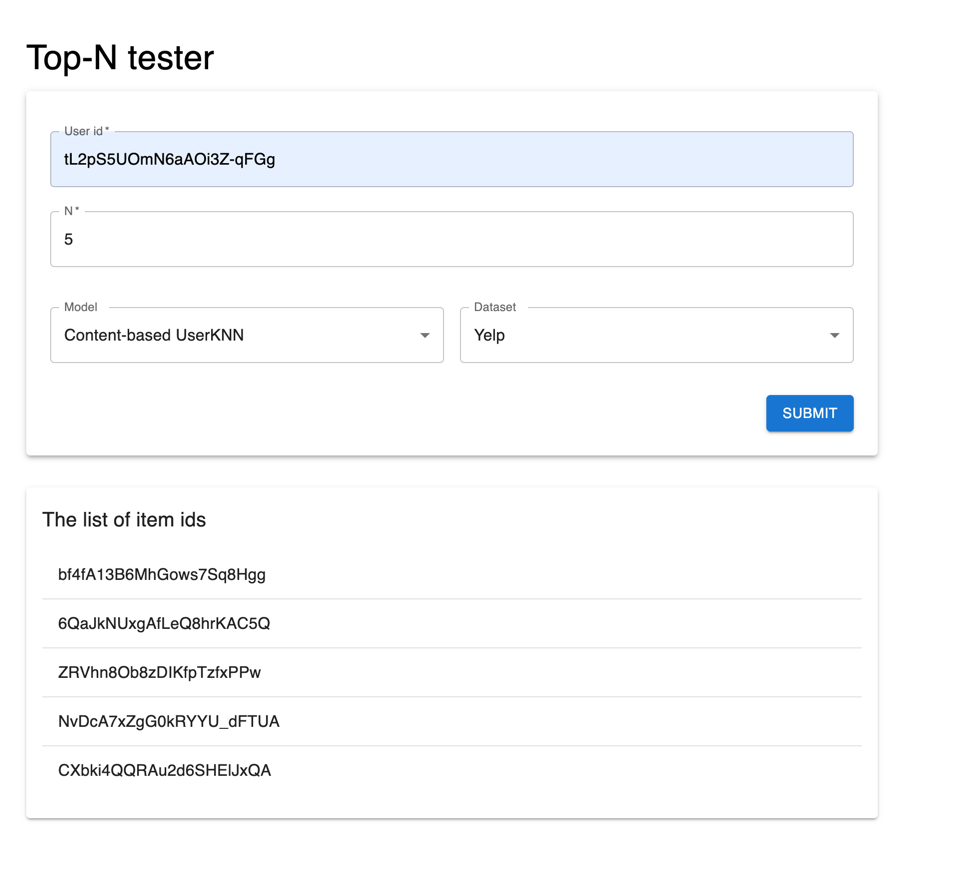

# Recommendation Systems Project

This project implements and compares various recommendation system algorithms across multiple datasets. The implementation includes collaborative filtering, content-based filtering, and matrix factorization approaches.

## Project Structure

```
.
├── eda/                    # Exploratory Data Analysis
│   ├── movie-lens.ipynb    # MovieLens dataset analysis
│   ├── netflix.ipynb       # Netflix dataset analysis
│   ├── yelp.ipynb          # Yelp dataset analysis
│   └── dataset_samples/    # Sampled datasets
│
├── rec-sys/                # Recommendation System Implementations
│   ├── common/             # Common utilities and metrics
│   ├── content-based/      # Content-based filtering
│   ├── item-knn/           # Item-based collaborative filtering
│   └── svd++/              # SVD++ matrix factorization
│
├── backend/                # FastAPI backend service
│   ├── main.py                    # Controller file with API
│   └── recommendation_service.py  # Service that contains pickle objects and dataset information
│
├── frontend/              # React frontend application
   ├── src/               # Source code
   │   ├── components/    # React components
   │   ├── types          # Types of TS
   │   ├── App.tsx        # Main component
   │   └── main.ts        # Start point
   └── public/            # Static assets
```

## Datasets

### MovieLens
- **Size**: 6040 users × 3706 items
- **Rating Scale**: 1-5 stars
- **Features**: User ratings, movie metadata
- **Sampling**: Full dataset used (no sampling needed)

### Netflix
- **Original Size**: Large-scale dataset
- **Rating Scale**: 1-5 stars
- **Features**: User ratings, movie metadata
- **Sampling**: Random sampling applied for computational efficiency

### Yelp
- **Original Size**: 900,000+ reviews
- **Rating Scale**: 1-5 stars
- **Features**: 
  - Review text
  - User ratings (stars)
  - Interaction metrics (useful, funny, cool)
  - Business categories
- **Sampling**: 10% random sample of open businesses in health category

## Metrics Description

The following metrics are used to evaluate recommendation systems:

1. **Relevance Metrics**
   - **Recovery**: Measures how early relevant items appear in top-N recommendations
   - **RMSE**: Root Mean Square Error between predicted and actual ratings

2. **Diversity & Coverage Metrics**
   - **Normalized AggDiv (diversity)**: Proportion of unique items recommended across users
   - **Normalized AggDiv (coverage)**: Proportion of catalog items recommended
   - **Item Space Coverage**: Distribution of items in recommendations

3. **Novelty & Serendipity Metrics**
   - **Normalized ItemDeg**: Novelty based on inverse item popularity
   - **Unexpectedness**: Proportion of unexpected (less popular) items
   - **Serendipity**: Proportion of unexpected and relevant items

## Dataset & Algorithm Comparison

### Relevance Metrics

| Model | Dataset | F1 Score | Recovery | RMSE | 
|-------|---------|----------|----------|------|
| Collaborative-based | MovieLens | N/A | None | 1.072 |
| Collaborative-based | Netflix | N/A | None | 0.922 |
| Content-based ItemKNN | MovieLens | 0.003 | 0.486 | N/A |
| Content-based ItemKNN | Yelp | 0.003 | 0.544 | N/A |
| Content-based UserKNN | MovieLens | 0.009 | 0.521 | N/A |
| Content-based UserKNN | Yelp | 0.001 | 0.373 | N/A |
| SVD++ | MovieLens | N/A | None | 0.988 |
| SVD++ | Yelp | N/A | None | 1.179 |

**Key Findings:**
- Collaborative-based shows best RMSE on Netflix (0.922)
- Content-based UserKNN achieves highest F1 score on MovieLens (0.009)
- Content-based ItemKNN shows best Recovery on Yelp (0.544)
- Content-based approaches focus on F1 score rather than RMSE
- SVD++ provides consistent RMSE across datasets

### Diversity & Coverage Metrics

| Model | Dataset | Normalized AggDiv (diversity) | Normalized AggDiv (coverage) | Item Space Coverage |
|-------|---------|------------------------------|----------------------------|-------------------|
| Collaborative-based | MovieLens | 0.134171 | 0.355368 | 25.031 |
| Collaborative-based | Netflix | 0.073533 | 0.573308 | 21.595 |
| Content-based ItemKNN | MovieLens | 0.110888 | 0.293700 | 24.685 |
| Content-based ItemKNN | Yelp | 0.378007 | 0.631688 | 56.581 |
| Content-based UserKNN | MovieLens | 0.0251 | 0.0665 | 22.452 |
| Content-based UserKNN | Yelp | 0.112618 | 0.188196 | 49.311 |
| SVD++ | MovieLens | 0.01541 | 0.040816 | 10.087 |
| SVD++ | Yelp | 0.043927 | 0.073406 | 21.383 |

**Key Findings:**
- Content-based ItemKNN on Yelp shows highest diversity (0.378) and coverage (0.632)
- Collaborative-based on Netflix achieves strong coverage (0.573) despite lower diversity
- Content-based UserKNN shows moderate performance across metrics
- SVD++ shows lower diversity and coverage compared to other approaches
- Yelp dataset generally enables better diversity and coverage

### Novelty & Serendipity Metrics

| Model | Dataset | Normalized ItemDeg | Unexpectedness | Serendipity |
|-------|---------|-------------------|----------------|-------------|
| Collaborative-based | MovieLens | 0.883 | 0.873 | 0.0 |
| Collaborative-based | Netflix | 0.891 | 0.882 | 0.0 |
| Content-based ItemKNN | MovieLens | 0.622 | 0.588 | 0.0 |
| Content-based ItemKNN | Yelp | 0.709 | 0.671 | 0.0 |
| Content-based UserKNN | MovieLens | 0.474 | 0.437 | 0.0 |
| Content-based UserKNN | Yelp | 0.628 | 0.587 | 0.0 |
| SVD++ | MovieLens | 0.29 | 0.548 | 0.0 |
| SVD++ | Yelp | 0.654 | 0.615 | 0.0 |

**Key Findings:**
- Collaborative-based consistently achieves highest novelty scores
- Collaborative-based on Netflix shows best novelty (0.891) and unexpectedness (0.882)
- All models fail to achieve serendipity (all 0.0)
- Content-based UserKNN shows moderate novelty performance
- SVD++ shows lower novelty but competitive unexpectedness

## Conclusions 

1. **Best Overall Performance:**
   - **Collaborative-based** shows strongest performance across most metrics:
     - Best RMSE on Netflix (0.922)
     - Strong diversity and coverage metrics
     - Best novelty and unexpectedness scores
   - **Content-based approaches** excel Recovery metrics
   - **SVD++** provides consistent but generally lower performance

2. **Dataset Impact:**
   - **Yelp** enables better diversity and coverage metrics
   - **Netflix** works well for accuracy and novelty
   - **MovieLens** shows balanced performance across metrics

3. **Algorithm Strengths:**
   - **Collaborative-based**: Best for accuracy (RMSE) and exploration metrics
   - **Content-based UserKNN**: Strong in relevance (Recovery) but weaker in diversity
   - **Content-based ItemKNN**: Best coverage and diversity on Yelp
   - **SVD++**: Consistent RMSE but lower exploration metrics

4. **Areas for Improvement:**
   - No algorithm achieves serendipity
   - Trade-off between accuracy and diversity remains challenging
   - Cold start issues evident in `Recovery` and `Serendipity` metrics
   - Cold start also affects the `F1-score` in content-based filtering approaches

5. **Key Trade-offs:**
   - Higher accuracy often comes with lower diversity
   - Better coverage typically means lower precision
   - Novelty and relevance show inverse relationship

## Usage

Each recommendation system implementation includes:
- Jupyter notebooks for experimentation
- Library code for production use
- Detailed README with setup instructions
- Example usage and configuration options

See individual implementation folders for specific usage instructions.

## Work splitting (in approaches)
- `SVD++` - common
- `content-based UserKNN` | `content-based ItemKNN` - Simon
- `collaborative-based ItemKNN` - Masoud

## Final service

The project includes a web service for testing recommendation models, consisting of a FastAPI backend and React frontend.

### How to Run

0. Address `semen.mokrov@gmail.com` for pretrained models and sampled datasets OR **reproduce it by yourself** (it's **too heavy** to upload it on GitHub)
   - **models** must be in the folder `models`
   - **sampled datasets** must be in the folder `eda/dataset_samples`

1. **Start the Backend**
   ```bash
   # Navigate to backend directory
   cd backend
   
   # Install dependencies
   pip install -r requirements.txt
   
   # Start the FastAPI server
   uvicorn main:app --reload
   ```

2. **Start the Frontend**
   ```bash
   # Navigate to frontend directory
   cd frontend
   
   # Install dependencies
   npm install
   
   # Start the development server
   npm run dev
   ```

### Service Flow

The Top-N Tester service provides an interactive interface for testing different recommendation models:



1. **Input Fields**:
   - **User ID**: Enter a valid user identifier from the selected dataset
   - **N**: Specify the number of recommendations to receive (top-N items)
   - **Model**: Choose the recommendation algorithm (Content-based UserKNN, ItemKNN, SVD++)
   - **Dataset**: Select the dataset to use (MovieLens, Yelp, Netflix)

2. **Request Process**:
   - Fill in all required fields
   - Click the "SUBMIT" button to send the request to the backend
   - The backend processes the request using the selected model and dataset

3. **Results Display**:
   - The service returns a list of recommended item IDs
   - Results are displayed in order of relevance
   - Each item ID represents a potential recommendation (movie or business depending on dataset)

### Technical Details

- The backend (`/backend`) serves pre-trained models and handles recommendation requests
- The frontend (`/frontend`) provides a user-friendly interface for testing different configurations
- Communication happens via REST API endpoints
- Models are loaded from pickle files containing pre-trained states
- The service supports cross-origin requests for development

